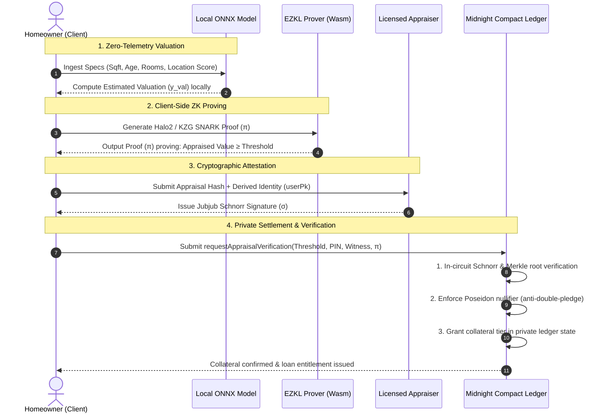

# VeilCred (ZK-Appraise)

### *Privacy-Preserving Home Equity Appraisal & Lending Protocol on Midnight Network*

<p align="center">
  
  
  
  
  
</p>

---

## 🏠 Overview

**VeilCred** enables homeowners to unlock decentralized finance (DeFi) liquidity against their real estate equity without exposing sensitive property data, street addresses, appraisal figures, or personal identities to public blockchains.

By combining **local client-side AI valuations (ONNX)**, **Zero-Knowledge Machine Learning proofs (Halo2 / EZKL)**, and **Midnight Network confidential smart contracts (Compact)**, VeilCred allows borrowers to prove collateral eligibility (Appraised Value ≥ Loan Threshold) and qualify for up to **75% LTV** credit tiers—completely in zero-knowledge.

```
   ┌──────────────────────┐       ┌──────────────────────┐       ┌──────────────────────┐
   │  1. Property Intake  │ ────> │  2. Local AI & ZKML  │ ────> │ 3. Midnight Compact  │
   │  Zero-telemetry specs│       │  In-browser Halo2 ZK │       │ Private state & loan │
   │  kept on your device │       │  KZG proof on BN254  │       │ outcome unlocked     │
   └──────────────────────┘       └──────────────────────┘       └──────────────────────┘
```

---

## ⚡ The Problem vs. The VeilCred Solution

| Dimension | Traditional Home Equity Loans | VeilCred (ZK-Appraise) |
| :--- | :--- | :--- |
| **Property Privacy** | Street address, parcel deeds & photos made public | 🔒 **100% Private** — raw specs never leave your browser |
| **Financial Privacy** | Full appraisal dollars and loan amounts exposed on-chain | 🔒 **Zero-Knowledge** — only eligibility tiers recorded |
| **Identity Linkage** | Wallet address directly bound to physical property title | 🔒 **Unlinkable Identity** — derived `UserPublicKey` + PIN |
| **Attestation** | Centralized, slow manual paper trail | ⚡ **Cryptographic** — Jubjub Schnorr attestations & Merkle proofs |
| **Double-Spend Risk** | Subject to manual title searches | ⚡ **Mathematical** — Poseidon nullifiers prevent re-pledging |

---

## 🚀 How It Works



---

## 💎 Loan Eligibility & Collateral Tiers

VeilCred dynamically classifies collateral into automated credit tiers based on verified property value:

| Tier Level | Valuation Floor | Max Eligible Loan | LTV Ceiling | Approval Mode |
| :--- | :--- | :--- | :--- | :--- |
| 🥇 **Tier 1 (Platinum)** | ≥ $1,000,000 | $750,000 | **75%** | Instant Approval |
| 🥈 **Tier 2 (Gold)** | ≥ $750,000 | $525,000 | **70%** | Instant Approval |
| 🥉 **Tier 3 (Silver)** | ≥ $500,000 | $325,000 | **65%** | Standard Protocol Review |
| 🎖️ **Tier 4 (Bronze)** | ≥ $300,000 | $180,000 | **60%** | Standard Protocol Review |

---

## 🎨 Web Application Features

The VeilCred DApp is designed for maximum speed, privacy, and visual excellence:

- 🛡️ **Zero-Telemetry Property Intake**: Enter living area, structural age, bedroom/bathroom counts, and socioeconomic indices without transmitting data to any backend server.
- 🧮 **Real-Time Loan Calculator**: Interactive sliders compute real-time LTV ratios, maximum borrowing capacity, and monthly payment estimates.
- ⚡ **Multi-Engine Prover Architecture**:
  - **In-Browser Web Worker (Wasm)**: Generates Halo2/KZG SNARK proofs client-side without UI freezing.
  - **Local Native Daemon**: High-speed desktop proof acceleration adapter.
  - **Dev Simulator**: Instant cryptographic simulation mode for rapid offline testing.
- 💼 **Midnight Lace Wallet Integration**: Seamless one-click wallet connectivity for confidential contract execution.
- 🔮 **Dark Glassmorphism Interface**: Smooth gradient mesh background, responsive mobile layouts, and animated state progression badges.

---

## 🔒 Privacy & Public Ledger Boundaries

| Data Element | Type | Storage / Processing | Public Visibility |
| :--- | :--- | :--- | :--- |
| **Property Specs & Address** | Private Input | Client Browser Only | ❌ Zero-Knowledge (Never leaves device) |
| **Exact Valuation Figure** | Private Witness | Client & Appraiser Secret | ❌ Hidden in SNARK Proof |
| **Applicant Secret Key & PIN** | Secret Witness | Client Wallet Session | ❌ Never Broadcast |
| **Appraiser Jubjub Signature** | Schnorr Signature | Private Witness Input | ❌ Verified In-Circuit |
| **Appraisal Commitment** | Hash Commitment | Merkle Tree (`MerkleTree<16, Bytes<32>>`) | ✅ Hash Only (Unlinkable) |
| **Appraisal Nullifier** | Spend Nullifier | Nullifier Set (`Set<Bytes<32>>`) | ✅ One-Time Spend Marker |
| **Derived User Public Key** | Domain Identifier | Ledger Map Index | ✅ Unlinkable to Primary Wallet |
| **Loan Status & Tier** | Outcome Struct | Public Ledger State | ✅ Authorized Tier & Status |

---

## 🏗️ Core Technology Stack

```
┌─────────────────────────────────────────────────────────────────────────────┐
│                            FRONTEND & CLIENT                                │
│   React 18  •  TypeScript  •  Vite  •  TailwindCSS  •  WebAssembly Workers  │
└──────────────────────────────────────┬──────────────────────────────────────┘
                                       │
┌──────────────────────────────────────▼──────────────────────────────────────┐
│                            ZKML PROVING ENGINE                              │
│    EZKL  •  Halo2 (KZG Commitments)  •  BN254 Curve  •  INT8 Quantization   │
└──────────────────────────────────────┬──────────────────────────────────────┘
                                       │
┌──────────────────────────────────────▼──────────────────────────────────────┐
│                           AI VALUATION ENGINE                               │
│      PyTorch 2.x  •  ONNX Runtime  •  California Housing Feature Model      │
└──────────────────────────────────────┬──────────────────────────────────────┘
                                       │
┌──────────────────────────────────────▼──────────────────────────────────────┐
│                         MIDNIGHT NETWORK LEDGER                             │
│     Compact 0.26  •  Jubjub Curves  •  Poseidon Sponges  •  Midnight.js     │
└─────────────────────────────────────────────────────────────────────────────┘
```

---

## 🚀 Quick Start Guide

### Prerequisites
- **Node.js**: `v18.0.0` or higher
- **Python**: `3.10` or `3.11`

### 1. Clone & Install Dependencies
```bash
git clone https://github.com/vishaltn74-dev/zk-appraise.git
cd zk-appraise

# Install root dependencies
npm install
```

### 2. Launch the Frontend DApp
```bash
cd frontend
npm install
npm run dev
```
Open **`http://localhost:5173`** (or `http://localhost:3000`) in your browser to experience the VeilCred interface.

### 3. Run the Smart Contract Test Suite
```bash
# From repository root
npm test
```

### 4. (Optional) Train & Export AI Valuation Model
```bash
# Setup Python environment
python -m venv .venv
# Activate: .venv\Scripts\Activate.ps1 (Windows) or source .venv/bin/activate (Linux/Mac)
pip install -r ai-engine/requirements.txt
pip install -e .

# Train model and export ONNX graph
python ai-engine/train_valuation_model.py
```

---

## 📂 Repository Structure

```
zk-appraise/
├── frontend/                         # React 18 / Vite DApp & Web Worker Prover
│   ├── src/
│   │   ├── components/               # Hero, PropertyIntakeForm, LoanCalculator, SiteNav
│   │   ├── hooks/                    # useMidnightContract state machine hook
│   │   ├── services/                 # contractBridge, proofService, prover adapters
│   │   └── workers/                  # prover.worker.ts (Wasm proof synthesis)
│   └── public/wasm/                  # Bundled EZKL WebAssembly runtime
│
├── contracts/                        # Midnight Compact privacy smart contracts
│   ├── appraiser_verifier.compact    # Full appraisal attestation & loan state machine
│   ├── src/
│   │   ├── AppraisalVerifier.compact # Modular proof verification circuit
│   │   ├── LoanCollateralPool.compact# Private borrower records & disbursement
│   │   └── NullifierRegistry.compact # Replay & double-pledge prevention
│   └── tests/
│       └── collateral_pool.test.ts   # Vitest contract simulation suite
│
├── zk-circuits/                      # ZKML circuit definitions & compiled artifacts
│   ├── src/
│   │   ├── model_gen.py              # PyTorch model topology & ONNX exporter
│   │   ├── circuit_builder.py        # EZKL settings calibration & Halo2 keygen
│   │   ├── export_abi.py             # Verification ABI & verification key exporter
│   │   └── verify_standalone.py      # Standalone auditor CLI verifier
│   ├── model.onnx                    # Serialized ONNX computational graph
│   └── CIRCUIT_MANIFEST.md           # Production circuit manifest & frozen VK hash
│
├── ai-engine/                        # Python ML training & dataset loader
│   ├── train_valuation_model.py      # Deterministic model training & ONNX export
│   ├── dataset_loader.py             # Feature extractor & validation pipeline
│   └── model_config.py               # Canonical model configuration
│
└── docs-pitch/                       # Architecture blueprints & execution plans
    ├── PLAN.md                       # Comprehensive engineering project plan
    └── AGENTS.md                     # Multi-agent role specifications
```

---

## 📄 License

This project is licensed under the **MIT License** — see the [LICENSE](LICENSE) file for details.

Built with 💜 for the **Midnight Network Ecosystem**.
