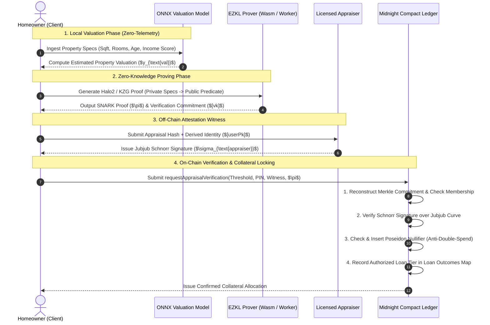

# ZK-Appraise (VeilCred)

### Zero-Knowledge Machine Learning (ZKML) Home Equity Appraisal & Lending Protocol on Midnight Network

<p align="center">
  
  
  
  
  
  
</p>

---

## 📌 Table of Contents

- [1. Executive Summary & Problem Statement](#1-executive-summary--problem-statement)
- [2. System Architecture & Protocol Flow](#2-system-architecture--protocol-flow)
- [3. Deep-Dive Component Breakdown](#3-deep-dive-component-breakdown)
  - [3.1 AI Valuation Engine (`ai-engine/`)](#31-ai-valuation-engine-ai-engine)
  - [3.2 ZKML Circuit Pipeline & EZKL Prover (`zk-circuits/`)](#32-zkml-circuit-pipeline--ezkl-prover-zk-circuits)
  - [3.3 Midnight Compact Smart Contracts (`contracts/`)](#33-midnight-compact-smart-contracts-contracts)
  - [3.4 Client Web Application & Prover (`frontend/`)](#34-client-web-application--prover-frontend)
- [4. Public vs. Private Ledger Boundaries](#4-public-vs-private-ledger-boundaries)
- [5. Empirical Benchmarks & Security Audit](#5-empirical-benchmarks--security-audit)
- [6. Graphify Knowledge Graph & Codebase Architecture](#6-graphify-knowledge-graph--codebase-architecture)
- [7. Monorepo Directory Layout](#7-monorepo-directory-layout)
- [8. Quick Start & Developer Runbook](#8-quick-start--developer-runbook)
- [9. Testing & Verification Suite](#9-testing--verification-suite)
- [10. Documentation Index](#10-documentation-index)
- [11. License & Team](#11-license--team)

---

## 1. Executive Summary & Problem Statement

Traditional home equity financing, appraisals, and decentralized finance (DeFi) collateralization require invasive disclosures. Borrowers must publicly expose:
- Physical property street addresses, parcel numbers, and interior layouts.
- Historical appraisal figures, tax records, and purchase receipts.
- Direct links between on-chain wallet addresses and real-world physical assets.

**ZK-Appraise (VeilCred)** is a next-generation privacy-preserving lending protocol built on the **Midnight Network**. It enables real estate owners to mathematically prove that their property meets or exceeds collateralization thresholds ($\text{Appraised Value} \ge \text{Loan Threshold}$) and qualify for up to **75% LTV** credit tiers **without disclosing property specifications, location, appraisal figures, or user identities on-chain**.

```
   ┌─────────────────────────────────────────────────────────────────────────────┐
   │                                  BORROWER                                   │
   │  Enters property attributes locally (Square footage, age, rooms, location)   │
   └──────────────────────────────────────┬──────────────────────────────────────┘
                                          │  Zero-Telemetry Local Execution
                                          ▼
   ┌─────────────────────────────────────────────────────────────────────────────┐
   │                              LOCAL AI ENGINE                                │
   │  Executes deterministic INT8 quantized ONNX Automated Valuation Model       │
   └──────────────────────────────────────┬──────────────────────────────────────┘
                                          │  Local Valuation Witness ($y_{\text{val}}$)
                                          ▼
   ┌─────────────────────────────────────────────────────────────────────────────┐
   │                            CLIENT-SIDE ZK PROVER                            │
   │  Synthesizes Halo2 / KZG SNARK Proof ($\pi$) over BN254 via EZKL / Wasm      │
   └──────────────────────────────────────┬──────────────────────────────────────┘
                                          │  Proof ($\pi$) + Off-chain Appraiser Schnorr
                                          ▼
   ┌─────────────────────────────────────────────────────────────────────────────┐
   │                         MIDNIGHT NETWORK CONTRACTS                          │
   │  • Enforces Jubjub Schnorr signature attestation & Merkle root inclusion    │
   │  • Verifies precision-safe collateral inequality: $[y] \ge [\text{Threshold}]│
   │  • Enforces Poseidon nullifier set (re-pledge & double-borrow protection)   │
   │  • Grants confidential loan tier (Platinum / Gold / Silver / Bronze)        │
   └─────────────────────────────────────────────────────────────────────────────┘
```

---

## 2. System Architecture & Protocol Flow

The protocol coordinates four decoupled environments: **Client Intake**, **Cryptographic Prover**, **Attestation Oracle**, and the **Midnight Privacy Ledger**.



---

## 3. Deep-Dive Component Breakdown

### 3.1 AI Valuation Engine (`ai-engine/`)
The automated valuation engine is responsible for training, quantizing, and hardening the real estate regression model:
- **Architecture**: Multi-layer linear regression optimized for zero-knowledge arithmetic circuit constraints (avoiding transcendental functions or saturating activations).
- **Dataset**: Trained on standardized California Housing real estate features with canonical selection:
  - `MedInc` (Median Area Income index)
  - `HouseAge` (Physical structural age)
  - `AveRooms` (Average rooms per dwelling)
  - `AveOccup` (Average occupancy density)
- **Quantization**: INT8 fixed-point calibration with scale power $S = 13$ (scale multiplier $2^{13} = 8,192$).
- **Safety & Ops**: Production audit logging (`audit.jsonl`), automated state rollback (`rollback.py`), integrity fingerprinting (`checksums.json`), and CI deployment gate verification (`deployment_validate.py`).

### 3.2 ZKML Circuit Pipeline & EZKL Prover (`zk-circuits/`)
The zero-knowledge circuit compiles the ONNX valuation graph into arithmetic constraint systems:
- **Proving System**: Halo2 with Kate-Zaverucha-Goldberg (KZG) polynomial commitments over the **BN254 (alt_bn128)** elliptic curve.
- **Circuit Geometry**: $k = 15$ ($2^{15} = 32,768$ rows).
- **Public / Private Visibility**:
  - `input_visibility: "private"` (property specifications, area indices, raw appraisal data).
  - `output_visibility: "public"` (quantized valuation predicate instance).
- **Circuit Manifest**: Frozen verification key commitment (`0xff02743ebfdfdc6e1d4ae98468de4b779516c9b1280122bc171b769bad9a8869`) stored in `zk-circuits/CIRCUIT_MANIFEST.md`.
- **Standalone Auditor CLI**: `zk-circuits/src/verify_standalone.py` enables third-party auditors and liquidity providers to verify proofs independently.

### 3.3 Midnight Compact Smart Contracts (`contracts/`)
Written in Midnight's **Compact** domain-specific smart contract language, providing zero-knowledge state transitions:
- **`appraiser_verifier.compact`**: Core state machine handling appraisal attestations, borrower identities, and loan tiers.
- **`AppraisalVerifier.compact`**: Modular verifier module executing Jubjub Schnorr signature verification and predicate checking.
- **`LoanCollateralPool.compact`**: Manages collateral records, max LTV calculation (up to 75%), and loan issuance.
- **`NullifierRegistry.compact`**: Prevents double-pledging through domain-separated Poseidon nullifiers (`zkappraisal:appraisal:nullifier:v1`).
- **Unlinkable Identity**: Derived `UserPublicKey` generated via `deriveUserPublicKey(sk, pin)` using domain separator `"zkappraisal:user:pk:v1"`, ensuring no linkage to the user's primary wallet address.

#### Loan Eligibility & Collateral Tiers:
| Tier Level | Valuation Floor ($) | Max Eligible Loan ($) | LTV Ceiling | Collateral Status |
| :--- | :--- | :--- | :--- | :--- |
| **Tier 1 (Platinum)** | $\ge \$1,000,000$ | $\$750,000$ | **75%** | Instant Approval |
| **Tier 2 (Gold)** | $\ge \$750,000$ | $\$525,000$ | **70%** | Instant Approval |
| **Tier 3 (Silver)** | $\ge \$500,000$ | $\$325,000$ | **65%** | Standard Review |
| **Tier 4 (Bronze)** | $\ge \$300,000$ | $\$180,000$ | **60%** | Standard Review |

### 3.4 Client Web Application & Prover (`frontend/`)
A responsive, dark-mode decentralized application built with React 18, TypeScript, Vite, and TailwindCSS:
- **Multi-Mode Prover Architecture**:
  1. `WasmEzklAdapter`: In-browser client proving via WebAssembly.
  2. `NativeEzklAdapter`: Local daemon prover for accelerated desktop compilation.
  3. `SimulatedDevAdapter`: Deterministic cryptographic test adapter for rapid offline development.
- **Worker-Thread Isolation**: Prover execution runs in a dedicated Web Worker (`prover.worker.ts`) to maintain 60 FPS UI responsiveness.
- **Midnight Wallet Integration**: Native bridge connecting to the Midnight Lace wallet for transaction signing and contract invocation.

---

## 4. Public vs. Private Ledger Boundaries

| Data Element | Type | Storage / Execution Layer | Public Ledger Visibility |
| :--- | :--- | :--- | :--- |
| **Property Specs & Address** | Private Input | Client Browser / Local Only | ❌ Zero-Knowledge (Hidden) |
| **Raw Valuation Figure ($)** | Private Witness | Client & Appraiser Secret | ❌ Zero-Knowledge (Hidden) |
| **Applicant Secret Key & PIN** | Secret Witness | Client Wallet / Local Session | ❌ Never Broadcast |
| **Appraiser Jubjub Signature** | Schnorr Signature | Private Witness Input | ❌ In-Circuit Verified |
| **Appraisal Commitment** | Hash Commitment | Merkle Tree (`MerkleTree<16, Bytes<32>>`) | ✅ Commitment Hash Only |
| **Appraisal Nullifier** | Spend Nullifier | Nullifier Set (`Set<Bytes<32>>`) | ✅ One-Time Spend Marker |
| **Derived User Public Key** | Domain Identifier | Ledger Map Index | ✅ Unlinkable to Wallet |
| **Approved Loan Outcome** | Result Struct | Public Ledger State Map | ✅ Tier & Authorized Amount |

---

## 5. Empirical Benchmarks & Security Audit

All performance and security claims are backed by rigorous test runs documented in [`reports/`](file:///c:/Users/KIIT/zk-appraise/reports/):

### Phase 1: Numerical Fidelity & Prover Benchmarks
*Tested against 15,000 unseen property validation vectors ([test_phase1_report.md](file:///c:/Users/KIIT/zk-appraise/reports/test_phase1_report.md)):*

| Metric | Target SLA | Measured Value | SLA Status |
| :--- | :--- | :--- | :--- |
| **Numerical Fidelity (MAPE)** | $\le 0.5\%$ | **$0.000728\%$** | ✅ **PASSED** |
| **Proof Generation Latency** | $\le 8.0\text{ s}$ | **$0.134\text{ s}$** (avg: $0.145\text{s}$) | ✅ **PASSED** |
| **Prover Memory Footprint** | $\le 2.0\text{ GB}$ | **$0.247\text{ GB}$** ($258.2\text{ MB}$) | ✅ **PASSED** |
| **Circuit Size ($k$)** | $k = 15$ | **$32,768$ rows** | ✅ **PASSED** |

### Phase 2: Adversarial Penetration & Cryptographic Hardening
*Evaluated across 50 stress iterations and adversarial attack suites ([test_phase2_security_report.md](file:///c:/Users/KIIT/zk-appraise/reports/test_phase2_security_report.md)):*

| Threat Model / Attack Vector | Verification Mechanism | Audit Outcome |
| :--- | :--- | :--- |
| **Proof Bit-Flip Mutation ($\pi'$)** | Halo2 Pairing & Curve Point Check | ✅ **REJECTED** (Soundness Verified) |
| **Public Input Forgery ($y'_{\text{val}}$)** | Halo2 Instance Scalar Validation | ✅ **REJECTED** (Tamper-Proof) |
| **Boundary & Float Overflow Fuzzing** | Quantized Domain Normalization | ✅ **STABLE** (No Crashes) |
| **Double-Pledge / Replay Attack** | Poseidon Sponge Nullifier Registry | ✅ **DEFENDED** (Collision-Free) |
| **50-Iteration Memory Leak Profile** | Continuous RSS Heap Profiling | ✅ **STABLE** ($\Delta = 0.44\text{ MB}$) |

---

## 6. Graphify Knowledge Graph & Codebase Architecture

The codebase architecture has been indexed and analyzed with **Graphify**, generating a knowledge graph of **1,080 nodes**, **1,701 edges**, and **71 modular communities**.

```
                         ┌─────────────────────────┐
                         │   Graphify Topology     │
                         │ 1080 Nodes · 1701 Edges │
                         └────────────┬────────────┘
                                      │
            ┌─────────────────────────┼─────────────────────────┐
            ▼                         ▼                         ▼
  ┌───────────────────┐     ┌───────────────────┐     ┌───────────────────┐
  │   AI Engine Hub   │     │  ZK Circuit Hub   │     │ Midnight Contract │
  │ `train_model.py`  │────>│ `circuit_builder` │────>│    `Contract`     │
  │  `load_data()`    │     │ `export_abi.py`   │     │ `contractBridge`  │
  └───────────────────┘     └───────────────────┘     └───────────────────┘
```

### Core Architectural Hubs (God Nodes):
1. **`Contract`** (38 connections): Midnight Compact ledger bindings and state dispatcher.
2. **`MidnightContractBridge`** (Cross-boundary bridge): Connects React hooks (`useMidnightContract`) to Midnight.js contract APIs.
3. **`load_data()`** (California Housing data lineage and deterministic tensor validation).
4. **`export_abi.py` / `CIRCUIT_MANIFEST.md`**: Cryptographic contract interface between EZKL and Compact.

### Exploring the Knowledge Graph:
```bash
# Query specific architectural relationships
graphify query "how does MidnightContractBridge verify proofs"

# Inspect core god nodes
graphify god-nodes

# Find dependency paths across subsystems
graphify path "train_valuation_model.py" "App.tsx" --undirected

# Update graph after modifying code
graphify update .
```

---

## 7. Monorepo Directory Layout

```
zk-appraise/
├── ai-engine/                        # Python ML training, calibration & safety harness
│   ├── cli.py                        # Standardized CLI argument parser
│   ├── model_config.py               # Single source of truth configuration
│   ├── dataset_loader.py             # California Housing loader & validator
│   ├── train_valuation_model.py      # Deterministic model training & ONNX export
│   ├── train_model.py                # Multi-epoch training with rollback safety
│   ├── security_utils.py             # Cryptographic checksums & directory validators
│   ├── audit.jsonl                   # Append-only execution audit log
│   └── test_ai_engine.py             # AI engine unit test suite
│
├── zk-circuits/                      # ZKML circuit definitions, compilation & keys
│   ├── src/
│   │   ├── model_gen.py              # PyTorch model topology & ONNX exporter
│   │   ├── circuit_builder.py        # EZKL settings calibration & Halo2 keygen
│   │   ├── export_abi.py             # Verification ABI & verification key exporter
│   │   └── verify_standalone.py      # Standalone auditor CLI verifier
│   ├── model.onnx                    # Serialized ONNX computational graph
│   ├── input_calibration.json        # Scale calibration dataset
│   ├── verifier_abi.json             # Serialized verifier schema & scale factors
│   ├── pk.key / vk.key               # Halo2 proving and verification keys
│   ├── kzg.srs                       # BN254 Structured Reference String
│   └── CIRCUIT_MANIFEST.md           # Production circuit manifest & frozen VK hash
│
├── contracts/                        # Midnight Compact privacy smart contracts
│   ├── appraiser_verifier.compact    # Full appraisal attestation contract
│   ├── Compact.toml                  # Compact package manifest
│   ├── ZK_APPRAISAL_VERIFIER_SPEC.md # Formal technical specification
│   ├── src/
│   │   ├── AppraisalVerifier.compact # Modular proof verification circuit
│   │   ├── LoanCollateralPool.compact# Private borrower records & disbursement
│   │   └── NullifierRegistry.compact # Replay & double-pledge prevention
│   ├── managed/                      # Compiled ZKIR binaries & TypeScript bindings
│   └── tests/
│       └── collateral_pool.test.ts   # Vitest contract simulation suite
│
├── frontend/                         # React 18 UI & In-Browser Prover DApp
│   ├── public/wasm/                  # Bundled EZKL WebAssembly binary assets
│   ├── src/
│   │   ├── components/
│   │   │   ├── PropertyIntakeForm.tsx# Private property specifications intake
│   │   │   ├── LoanCalculator.tsx    # Real-time LTV ratio & collateral eligibility
│   │   │   ├── WalletConnector.tsx   # Midnight Lace Wallet connector
│   │   │   ├── Hero.tsx              # Landing hero with real-time stats
│   │   │   ├── SiteNav.tsx           # Navigation header & contract status
│   │   │   └── GradientMesh.tsx      # High-performance background visualizer
│   │   ├── hooks/
│   │   │   └── useMidnightContract.ts# State machine hook for proving & submission
│   │   ├── services/
│   │   │   ├── contractBridge.ts     # TypeScript bridge to Midnight.js APIs
│   │   │   ├── proofService.ts       # Web Worker RPC message dispatcher
│   │   │   └── prover/               # Pluggable prover adapters (Wasm, Native, Sim)
│   │   └── workers/
│   │       └── prover.worker.ts      # Dedicated Web Worker for local proof synthesis
│   └── package.json
│
├── tests/                            # Cross-cutting test suites
│   ├── zk/
│   │   ├── test_fidelity.py          # 15,000-vector accuracy & prover profiling
│   │   ├── test_adversarial.py       # Bit-flip and scalar mutation attacks
│   │   ├── test_compact_abi.py       # Compact ABI compatibility checks
│   │   └── test_security_audit.py    # 50-cycle stress & memory leak audit
│   └── e2e/
│       └── test_full_pipeline.py     # End-to-end Python -> EZKL -> Compact pipeline
│
├── docs-pitch/                       # Architecture blueprints & execution plans
│   ├── PLAN.md                       # Comprehensive engineering project plan
│   ├── AGENTS.md                     # Multi-agent role specifications
│   └── implementationplann.md        # Cryptography & ZKML engineering spec
│
├── reports/                          # Audit & benchmark reports
│   ├── test_phase1_report.md         # Numerical fidelity & resource benchmarks
│   └── test_phase2_security_report.md# Adversarial penetration audit results
│
├── graphify-out/                     # Graphify knowledge graph outputs
│   ├── graph.json                    # Complete AST & semantic topology graph
│   └── GRAPH_REPORT.md               # Graph report, god nodes & community metrics
│
├── pyproject.toml                    # Root Python dependencies & build config
├── tsconfig.json                     # TypeScript compiler configuration
└── package.json                      # Root npm configuration & test scripts
```

---

## 8. Quick Start & Developer Runbook

### Prerequisites
- **Node.js**: v18.0.0 or higher
- **Python**: 3.10 or 3.11
- **Midnight Compact Compiler**: `compactc` v0.26.0+ (optional for contract re-compilation)

### Step 1: Clone Repository & Install Root Dependencies
```bash
git clone https://github.com/vishaltn74-dev/zk-appraise.git
cd zk-appraise

# Install root dependencies (Vitest, TypeScript, Midnight.js)
npm install
```

### Step 2: Configure Python Virtual Environment & Train Model
```bash
# Set up Python virtual environment
python -m venv .venv

# Activate environment:
# On Windows (PowerShell):
.venv\Scripts\Activate.ps1
# On Linux / macOS:
source .venv/bin/activate

# Install AI engine dependencies
pip install -r ai-engine/requirements.txt
pip install -e .

# Run deterministic training and export ONNX model
python ai-engine/train_valuation_model.py
```

### Step 3: Run Standalone Circuit Verification CLI
```bash
# Execute independent cryptographic auditor check
python zk-circuits/src/verify_standalone.py \
  --proof zk-circuits/proof.json \
  --vk zk-circuits/vk.key \
  --settings zk-circuits/settings.json \
  --srs zk-circuits/kzg.srs \
  --threshold 400000
```

### Step 4: Launch the Frontend Web Application
```bash
cd frontend
npm install
npm run dev
```
Open **`http://localhost:5173`** (or `http://localhost:3000`) in your browser to interact with the VeilCred decentralized application.

---

## 9. Testing & Verification Suite

### Smart Contract Unit & Simulation Tests
```bash
# Run Compact contract tests via Vitest
npm test
```

### Python Cryptographic & Security Test Suites
```bash
# Run all Python unit, fidelity, and security tests
pytest

# Run 15,000-vector numerical fidelity verification
pytest tests/zk/test_fidelity.py

# Run adversarial penetration test suite (bit-flips, scalar forgery)
pytest tests/zk/test_adversarial.py

# Run 50-iteration prover stress & memory leak audit
pytest tests/zk/test_security_audit.py

# Run end-to-end pipeline test
pytest tests/e2e/test_full_pipeline.py
```

### Frontend Production Build & Typecheck
```bash
npm run build:frontend
```

---

## 10. Documentation Index

- 📐 **[docs-pitch/PLAN.md](file:///c:/Users/KIIT/zk-appraise/docs-pitch/PLAN.md)**: Engineering Architecture & Multi-Phase Delivery Plan.
- 👥 **[docs-pitch/AGENTS.md](file:///c:/Users/KIIT/zk-appraise/docs-pitch/AGENTS.md)**: Multi-Agent Execution Roles & Boundaries.
- 📜 **[contracts/ZK_APPRAISAL_VERIFIER_SPEC.md](file:///c:/Users/KIIT/zk-appraise/contracts/ZK_APPRAISAL_VERIFIER_SPEC.md)**: Technical Specification for Midnight Compact Smart Contracts.
- 🔐 **[zk-circuits/CIRCUIT_MANIFEST.md](file:///c:/Users/KIIT/zk-appraise/zk-circuits/CIRCUIT_MANIFEST.md)**: Production Circuit Manifest & Frozen VK Hash.
- 📊 **[reports/test_phase1_report.md](file:///c:/Users/KIIT/zk-appraise/reports/test_phase1_report.md)**: Phase 1 Numerical Fidelity & Profiling Report.
- 🛡️ **[reports/test_phase2_security_report.md](file:///c:/Users/KIIT/zk-appraise/reports/test_phase2_security_report.md)**: Phase 2 Security Penetration & SLA Report.
- 🌐 **[graphify-out/GRAPH_REPORT.md](file:///c:/Users/KIIT/zk-appraise/graphify-out/GRAPH_REPORT.md)**: Graphify Knowledge Graph Topology & Community Report.

---

## 11. License & Team

This project is licensed under the **MIT License** — see the [LICENSE](LICENSE) file for details.

Built with 💜 for the **Midnight Network Ecosystem**.
